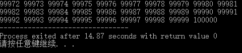
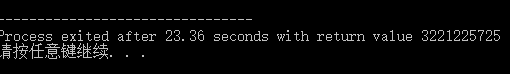

#递归产生的问题
---
###题目示例
	写程序实现一个函数PrintN，使得传入一个正整数为N的参数后，能顺序打印从1到N的全部正整数。
- [x] 解决办法（一）： 循环输出
```C++
void printn(int n){
	for(int i = 1; i <= n; i++)
		printf("%d ",i);
}  
```

- [x] 解决办法（二）： 递归实现
```C++
void printn(int n){
	if(n){
		printn(n-1);
		printf("%d ", n);
	}
} 
```
当n取100/1000/10000时并没有问题出现，但是当n取100000时，循环输出可以正确输出到10万：

但是此时递归实现的输出出现了异常：

虽然写递归代码，减少了很多代码量，使代码看上去很简洁，让自己和别人都更容易理解，但是，递归的问题在于，它对空间的占用量，有时候是很恐怖的，比如上面这个出现的问题：
它要将1之前的数字全都保存在递归栈里面，而这个问题的规模上升到10万的时候，它所能用的递归栈的容量都被占满了，可能还有很多数字没有被压进去，但是已经压不进去了，所以他来不及打出来一个数字就被迫终止。
