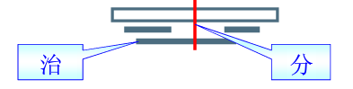
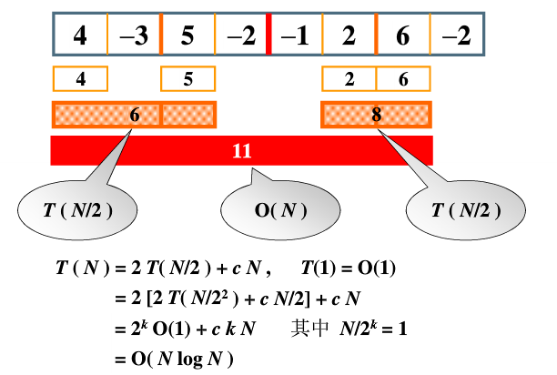
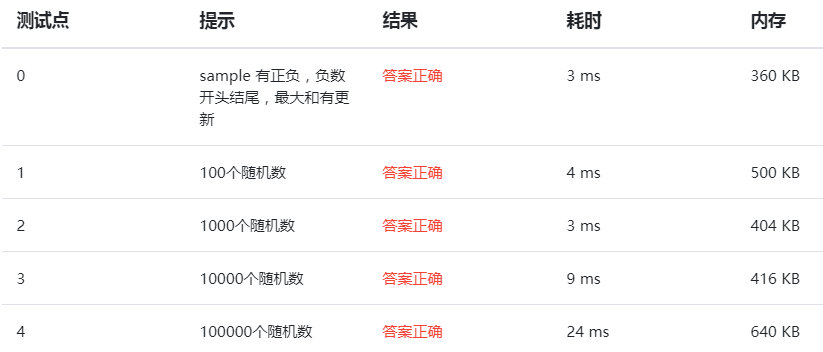
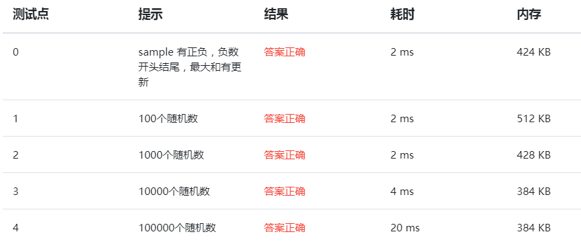

最大子序列和（分治或在线处理）
---
题目描述
    给定N个整数的序列{A1,A2,...,An}，求函数f(i,j) = max{0,$\sum_{k=1}^{n}$A<sub>k</sub>}的最大值。
* **分治法 ：时间复杂度O(NlogN)**

</br>
对于这个问题使用分而治之的思想，是对于每一个当前处理的区域，求出左半边的最大子序列和的值，求出右半边最大子序列和的值，然后从中间开始向两边扫描求出中间最大子序列和的值，三者中最大的那个值就是当前处理区域的最大子序列之和。</br>
</br>
关于时间复杂度：处理左/右半边的时间复杂度是T(N/2)，扫描得到中间的最大和的时间复杂度是O(N)。再把递归的时间迭代进T(N/2)中去，最后得到，时间复杂度就是O(NlogN)。其中k=logN。</br>
**代码：**
    ```C++
    #include <iostream>
    using namespace std;
    int n, maxn = 0, arr[100005];
    int Max3(int a, int b, int c){
        return a > b ? a > c ? a : c : b > c ? b : c; 
    }
    int DivideAndConquer(int left, int right){
        int MaxLeftSum, MaxRightSum;
        int MaxLeftBorderSum, MaxRightBorderSum;
        
        int LeftBorderSum, RightBorderSum;
        int center,i;
        
        if(left == right){
            if(arr[left] > 0) return arr[left];
            else return 0;
        }
        
        center = (left + right)/2;
        MaxLeftSum = DivideAndConquer(left, center);
        MaxRightSum = DivideAndConquer(center+1, right);
        
        LeftBorderSum = 0; MaxLeftBorderSum = 0;
        for(int i = center; i >= left; i--){
            LeftBorderSum += arr[i];
            if(LeftBorderSum > MaxLeftBorderSum) MaxLeftBorderSum = LeftBorderSum;
        }
        
        RightBorderSum = 0; MaxRightBorderSum = 0;
        for(int i = center+1; i <= right; i++){
            RightBorderSum += arr[i];
            if(RightBorderSum > MaxRightBorderSum) MaxRightBorderSum = RightBorderSum;
        }
        
        return Max3(MaxLeftSum, MaxRightSum, MaxLeftBorderSum + MaxRightBorderSum); 
    }
    int main(){
        scanf("%d",&n);
        for(int i = 0; i < n; i++){
            scanf("%d",&arr[i]);
        }
        maxn = DivideAndConquer(0, n-1);
        printf("%d",maxn);
        return 0;
    }
    ```
    程序耗时和所耗内存情况：从下图可以看出内存有增长的趋势（因为递归要保存未出栈的数据）,耗时近似对数增长。
    
* **在线处理法 ：时间复杂度O(N)**
在线处理的思想是每输入一个数据就进行及时处理，在任何一个地方中止输入，算法都能给出当前正确解。</br>
对于本文的问题，就是每输入一个数据，就进行累加，用MaxSum记录当前最大的子序列和，用TempSum记录当前累加的和的情况，如果TempSum > MaxSum，则更新MaxSum。当TempSum < 0的时候，需要将当前位置左边的所有数据抛弃，即令TempSum = 0；因为如果TempSum小于0，那么对后面任一序列的作用都是减弱，而没有增加的作用，不可能会是最大子序列和的一部分，需要抛弃。</br>
    ```C++
    #include <iostream>
    using namespace std;
    int main(){
        int n, maxn = 0, temp = 0;
        scanf("%d",&n);
        for(int i = 0; i < n; i++){
            int a;scanf("%d",&a);
            temp += a;
            if(maxn < temp){
                maxn = temp;
            }
            if(temp < 0) temp = 0;
        }
        printf("%d",maxn);
        return 0;
    }
    
    ```
    程序耗时和所耗内存情况：从下图可以看出内存几乎不变O(1),耗时近似线性增长。与分治横向比较，可以看出耗时和内存上表现的都是更好。
    


